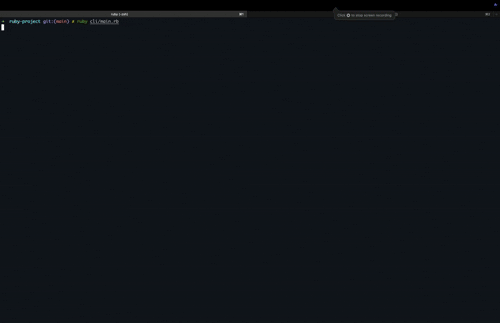
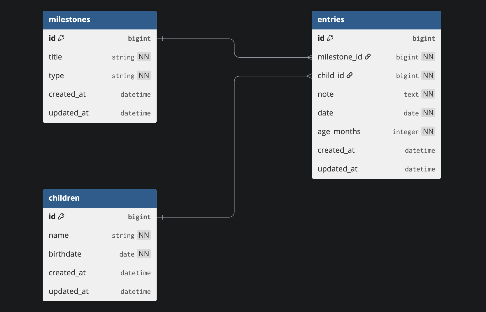

# LittleByLittle

`LittleByLittle` is a Ruby CLI CRUD application for logging and tracking a child's developmental milestones. Users can create child profiles, add milestone entries, view and update records, and visualize progress — utilizing a Sinatra JSON API backend.



---

## Features

- Create, view, update, and delete:
  - Children
  - Milestones
  - Milestone entries
- Filter entries by child or milestone

---

## Run Instructions

### 1. Clone the repo

```bash
git clone git@github.com:kyleghousel/LittleByLittle.git
cd LittleByLittle
```

### 2. Install dependencies

Make sure you have Ruby installed (3.x recommended). Then run:

```bash
bundle install
```
### 3. Set up the database with test data

```bash
bundle exec rake db:create db:migrate db:seed
```

### 4. Start the Sinatra backend

From the project root (or the API folder if separated), run:

```bash
bundle exec rackup
```

The server should start at `http://localhost:9292`.

### 5. Run the CLI app

In a separate terminal tab:

```bash
ruby cli/main.rb
```

You’ll now be in the LittleByLittle terminal interface!

---

## Requirements

- Ruby 3.x
- Bundler
- `rest-client`, `pry`, `json`, etc. (managed via `Gemfile`)
- Sinatra (for backend API)

---

## Application Schema
---

